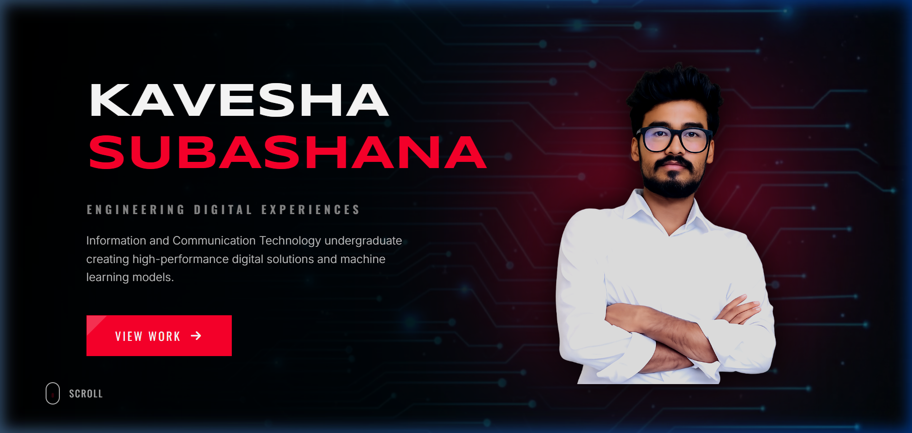
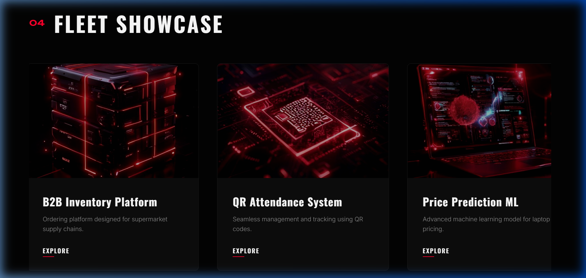
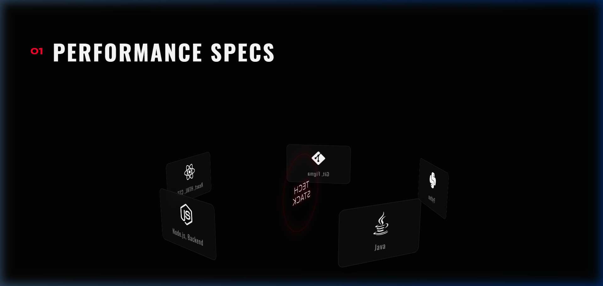
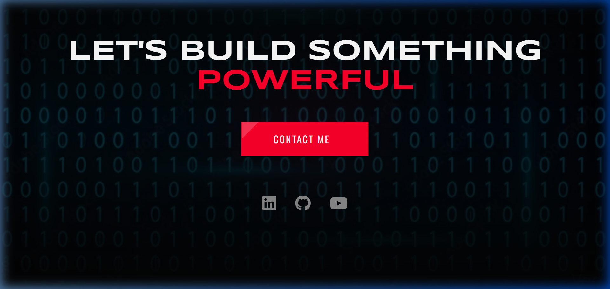

# KAVESHA SUBASHANA | Portfolio 🚀

A premium, high-performance portfolio website engineered for cinematic digital experiences. This project showcases the work, skills, and engineering philosophy of Kavesha Subashana, an ICT undergraduate specializing in software development and machine learning.



## ✨ Key Features

- **Cinematic Hero Section**: Immersive background video with smooth GSAP typography animations.
- **3D Performance Specs**: Interactive 360° skills showcase visualizing the tech stack.
- **Exploded Engineering View**: A layered conceptualization of code architecture and logic.
- **Horizontal Fleet Showcase**: A smooth, high-performance project gallery with hover-activated specs.
- **Responsive Engineering**: Fully optimized for mobile, tablet, and desktop viewports.
- **Smooth Navigation**: Integrated Lenis smooth scroll for a premium tactile feel.

## 🛠️ Technology Stack

| Category | Technologies |
| :--- | :--- |
| **Frontend** | HTML5, CSS3 (Vanilla), JavaScript (ES6+) |
| **Animations** | GSAP (GreenSock Animation Platform), ScrollTrigger |
| **Scrolling** | Lenis Smooth Scroll |
| **Icons** | Font Awesome |
| **Typography** | Google Fonts (Oswald, Inter, Syncopate) |

## 📂 Project Showcase

### 1. B2B Inventory Platform
A streamlined supply chain ordering system for supermarkets and suppliers, eliminating manual processes.


### 2. QR Attendance System
Java-based application for seamless attendance tracking and management using QR code generation.

### 3. Price Prediction ML
Machine learning model using Random Forest Regressor to predict laptop prices, deployed via Flask.

### 4. Sentiment Analysis
NLP model built with Logistic Regression for analyzing text sentiment (Positive/Negative/Neutral).

## 🚀 Performance & Design

The site is built with a focus on **visual excellence** and **interaction design**.
- **Dark Mode Aesthetic**: Premium dark theme with red accents and glassmorphism.
- **Micro-interactions**: Hover effects, marquee scrolls, and piston-style animations.
- **Tech Stack Sphere**: A visual representation of core competencies.



## 🛠️ Installation & Local Development

1. **Clone the repository**:
   ```bash
   git clone https://github.com/kaveeshasubashana/kaveeshaportfolio.git
   ```
2. **Navigate to the directory**:
   ```bash
   cd kaveeshaportfolio
   ```
3. **Run a local server**:
   You can use any local server (e.g., Live Server in VS Code, or Python's http.server).
   ```bash
   python -m http.server 8000
   ```
4. **Open in Browser**:
   Navigate to `http://localhost:8000`.

---

## 📫 Connect with Me

<div align="left">
  <a href="https://linkedin.com/in/kaveesha-subashana/"></a>
  <a href="https://github.com/kaveeshasubashana/"></a>
  <a href="mailto:kaveeshasubashana@gmail.com"></a>
</div>



---
Developed with ❤️ by **Kavesha Subashana**
